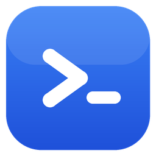

# Adit



Adit is a native, Rust-only desktop SSH terminal client inspired by SecureCRT and Xshell. Windows is the first-class target, with macOS support kept in the architecture.

It is built on `iced` (GUI), `russh` (pure-Rust SSH), and an Adit-owned `vte`-based terminal core — no web view, no JavaScript. The product is the Cargo workspace under [`crates/`](crates/).

> The original Tauri + TypeScript/xterm.js prototype has been removed now that the native client supersedes it; it remains available in git history.

The app icon lives in [`assets/`](assets/) and is reproducible with `python assets/make_icon.py` (requires Pillow), which regenerates the master PNG plus the build inputs: the Windows exe-resource `.ico` ([crates/adit-app/assets/](crates/adit-app/assets/)) embedded via `build.rs`, and the raw RGBA window icon ([crates/adit-ui/assets/](crates/adit-ui/assets/)) loaded at runtime.

## Architecture

A mostly-pure-Rust desktop SSH client based on `iced + russh + vte`.

**Documentation**

| Doc | What it covers |
|---|---|
| [docs/architecture.md](docs/architecture.md) | How it's built: crates, threading, event protocols, storage, RDP subsystem |
| [docs/features.md](docs/features.md) | Everything it does today — plus an honest list of known gaps |
| [docs/decisions.md](docs/decisions.md) | Why it's built that way, including the decisions we reversed |
| [CLAUDE.md](CLAUDE.md) | Traps that cost real debugging time; conventions |
| [docs/rdp-gnome-remote-desktop.md](docs/rdp-gnome-remote-desktop.md) | GNOME Remote Desktop handover: EGFX, RDSTLS, Server Redirection |
| [crates/adit-rdp/IRONRDP-PATCHES.md](crates/adit-rdp/IRONRDP-PATCHES.md) | The three vendored IronRDP patches and when to drop them |

Backlogs (plans, not current state): [feature-roadmap.md](docs/feature-roadmap.md),
[phase2-plan.md](docs/phase2-plan.md). The original design doc is kept at
[native-rust-architecture.md](docs/native-rust-architecture.md) for history.

The workspace crates:

- `adit-app` — binary entrypoint (iced runtime, embedded window/exe icon)
- `adit-ui` — iced screens, terminal widget, theme, input handling
- `adit-session` — session manager and per-session actor lifecycle
- `adit-ssh` — `russh` wrapper: auth, host-key verification, PTY shell, keepalive
- `adit-terminal` — `vte`-driven VT/ANSI grid and render-ready snapshots
- `adit-storage` — profiles, settings, encrypted credential store, log directory
- `adit-domain` — shared ids, errors, profile/auth models

Plus two crates for RDP:

- `adit-rdp-proto` — the IPC wire types (serde + bincode), shared by both sides
- `adit-rdp` — **its own workspace** (own `Cargo.lock`, `exclude`d from the root), building the `adit-rdp-host.exe` helper

**Why RDP is a separate workspace + a separate process:** IronRDP pulls `picky`, which exact-pins pre-release RustCrypto crates that conflict irreconcilably with the versions `russh` needs — two `ecdsa` versions can't coexist in one binary, and `=`-pins can't be `[patch]`ed apart. So the RDP stack is built separately and driven over stdin/stdout (length-prefixed bincode). Build it with `--manifest-path crates/adit-rdp/Cargo.toml`, never `-p`. See [`crates/adit-rdp/IRONRDP-PATCHES.md`](crates/adit-rdp/IRONRDP-PATCHES.md) and [docs/rdp-gnome-remote-desktop.md](docs/rdp-gnome-remote-desktop.md).

The Windows installer is built with **Inno Setup** from [`installer/adit.iss`](installer/adit.iss) (a proper setup wizard), not a workspace crate.

## Credential storage

Passwords and key passphrases are stored **encrypted at rest** in `credentials.json`, next to `profiles.json` in the config directory:

- **XChaCha20-Poly1305**, key derived with **Argon2id**, a fresh random nonce per write, written atomically (temp + rename).
- The config directory is relocatable, so pointing it at a synced folder carries credentials between machines. This replaced an OS-keyring store, which was machine-local and therefore lost passwords on every other machine.
- Secrets an older build left in the OS keyring are imported once at startup.

**Security model — do not overstate this.** The KDF's only secret input is a key **built into the binary**; there is no master password (a deliberate trade-off for zero-setup syncing). That keeps credentials out of plaintext on disk, out of backups, and un-greppable — but **anyone with the file and the (open-source) key can recover every password**. It is obfuscation, not secrecy. The KDF is shaped so a real user passphrase could be mixed in later without a file-format change; only that would make it genuinely secret.

## Features

- Connection profiles with folders/groups: create, edit, delete, drag-reorder, sort, rename group, filter.
- Authentication: password, keyboard-interactive (MFA-aware), public key (`~/.ssh` defaults or an explicit identity file), and SSH agent (Windows OpenSSH pipe / Pageant, Unix `SSH_AUTH_SOCK`).
- Host-key security: interactive first-use confirmation showing the SHA256 fingerprint, with a changed-key (MITM) warning; verified keys are stored in a per-app `known_hosts`.
- Secrets: optional password persistence in the OS credential vault (never in profile JSON).
- Real ANSI/VT terminal: 16/256/truecolor + attributes, cursor motion, erase/scroll regions, alternate screen, scrollback, wide (CJK) glyphs.
- Terminal UX: raw keyboard routing (Ctrl/Alt/function/navigation keys), mouse selection + copy/paste, scrollback navigation, automatic PTY resize.
- Multi-tab workspace, keepalive, and auto-reconnect with exponential backoff on unexpected drops.
- SFTP dual-pane file manager (SecureFX-style): browse local and remote side by side; transfer via double-click, multi-select batch, pane-to-pane drag, or drag-from-Explorer (plus a native file picker); rename/delete on both panes; clickable column sorting; and a detailed transfer queue (destination, size, progress, speed) over a second SSH connection reusing the session credential.
- Port forwarding: local (`-L`), dynamic SOCKS5 (`-D`), and remote (`-R`) tunnels, created and managed from a tunnels panel, optionally saved per profile to auto-start on connect, with live status and active-connection counts.
- Protocols beyond SSH: local shell (ConPTY), serial (COM/tty), and RDP (launches the system client).
- Split panes (2–4 tiled sessions), input broadcast to all sessions, per-profile startup command, per-profile `TERM`, and a configurable connect timeout.
- Terminal power features: scrollback search (Ctrl+Shift+F) with highlight and next/prev, mouse-reporting passthrough for TUIs (vim/tmux/htop), bracketed paste + multi-line paste confirmation, optional copy-on-select / right-click-paste, and italic/dim rendering.
- Configurable fonts + color schemes, configurable scrollback size, and a configuration folder (relocatable via `ADIT_CONFIG_DIR`).
- Session logging with a configurable folder, filename pattern, auto-log-on-connect, and an optional ANSI-stripped plaintext format.
- Import hosts from `~/.ssh/config`, and in-app check-for-updates with one-click update.
- Dark/light theme and full settings persistence.

## Development

Run the app:

```powershell
cargo run -p adit-app
```

Select or create a profile, optionally enter an SSH password, and connect. With an empty password Adit still tries the SSH agent and default keys under `~/.ssh`. Profiles persist to `profiles.json` under the platform app config directory (shown in the status bar).

Saved passwords and key passphrases live **encrypted** in `credentials.json` in that same directory — deliberately, so pointing the config directory at a synced folder (Dropbox, etc.) carries them between machines. They are never written to `profiles.json`. See [Credential storage](#credential-storage) for the security model, which is **obfuscation, not secrecy**.

Most tasks are wrapped in a [`justfile`](justfile) — run `just` to list them:

```powershell
just ci          # what CI runs: build + clippy (-D warnings) + test
just build       # release-build the GUI app
just dist        # app + RDP helper (both shippable binaries)
just run         # build and launch
just deploy      # copy fresh binaries over the installed Adit
```

Or the raw commands:

```powershell
cargo check --workspace
cargo clippy --workspace --all-targets -- -D warnings   # CI treats warnings as errors
cargo test --workspace
```

Build the Windows installer (requires [Inno Setup 6](https://jrsoftware.org/isdl.php)):

```powershell
just dist                  # NOTE: the RDP helper is a separate workspace — see below
just installer <version>
```

The `just dist` step matters: `cargo build -p adit-app` alone does **not** build `adit-rdp-host.exe`, because the RDP helper is its own workspace (see [Architecture](#architecture)). The installer bundles both binaries, so building only the app yields an installer whose RDP support is stale or missing.

This produces `target\release\adit-installer-v<version>.exe` — a setup wizard that installs to `C:\Program Files\Adit` (all users, or per-user), creates shortcuts, registers an uninstaller, and closes a running instance before updating.

## Roadmap

Most of the phased plan is implemented — SSH/SFTP/tunnels, four protocols, split panes, broadcast, fonts/schemes, scrollback search, mouse passthrough, bracketed paste, `~/.ssh/config` import, in-app updates, and the Inno Setup installer.

Still open: jump host / `ProxyJump`, command snippets, tab rename, code signing, CI, and macOS packaging. See [docs/feature-roadmap.md](docs/feature-roadmap.md) for the full status.
