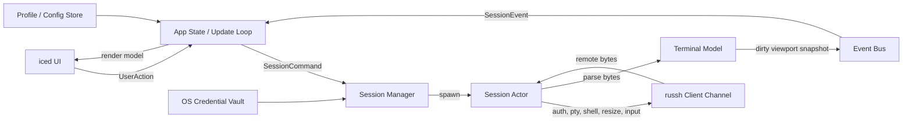

# Adit Native Rust Architecture

Date: 2026-06-27
Status: Proposed target architecture, native prototype in progress

Implementation status:

- Phase 0 is complete enough for a native workbench prototype.
- Phase 1 has started.
- A root Cargo workspace now exists.
- `adit-app`, `adit-ui`, `adit-domain`, `adit-session`, `adit-storage`, and `adit-terminal` are present.
- `cargo run -p adit-app` opens a SecureCRT-style native iced prototype with menu bar, toolbar, session manager sidebar, tabs, command input, and status bar.
- The native prototype now includes clickable menu commands and persistent profile CRUD in the session manager sidebar.
- `adit-ssh` is present with `russh` PTY shell support and an auth chain covering password, keyboard-interactive, SSH agent, and default private key fallback.
- Long-lived SSH actors are wired for connect, output streaming, input, resize commands, and disconnect.
- `adit-terminal` now hosts a real ANSI/VT core (`VtTerminal`) driven by the `vte` parser, and it backs every session in `adit-session`; the old line-buffer `MockTerminal` is gone. The UI renders coalesced colored cell runs and a block cursor.
- Raw keyboard routing is wired through iced subscriptions for ignored key events, covering regular text, common navigation keys, function keys, Alt-prefix text, and Ctrl-A through Ctrl-Z.

This document defines the target architecture for moving Adit from the current Tauri + xterm.js MVP to a mostly pure Rust desktop SSH terminal client. It also tracks the current native prototype so implementation does not drift from the target shape.

## Decision

Adit will use the following target stack:

- GUI: `iced`
- SSH transport: `russh`
- Async runtime: `tokio`
- Terminal core: reuse `alacritty_terminal` first; fall back to `vte` plus an Adit-owned grid if the Alacritty integration is too coupled
- Storage: local profile/config files through Rust filesystem APIs
- Secrets: OS credential vaults through a Rust abstraction

The current Tauri MVP remains useful as a behavior reference until the native Rust client can connect, render, and manage tabs reliably.

## Goals

- Keep application code Rust-first and remove TypeScript/WebView from the long-term product.
- Prioritize Windows desktop quality first, while keeping macOS support in the architecture.
- Build toward SecureCRT/Xshell style workflows: session groups, tabs, reconnect, host key management, key auth, jump hosts, SFTP, logging, and transcript search.
- Own the terminal UX enough to support high-quality keyboard handling, copy/paste, search, themes, and large scrollback.
- Isolate risky dependencies behind Adit traits so SSH, terminal parsing, and rendering can evolve independently.

## Non-Goals For The First Native Milestone

- Full SecureCRT/Xshell parity.
- Telnet, serial, RDP, or local shell tabs.
- Full custom terminal emulator from scratch.
- Plugin system.
- Password persistence outside the OS credential vault.

## Architecture Overview



The important boundary is that a terminal tab is not just a UI widget. It is a session actor that owns SSH state, terminal state, resize state, and the command queue for one connection.

## Core Modules

### `adit-ui`

Responsibilities:

- Iced application shell
- Sidebar, session tree, tabs, connection dialogs, settings screens
- Terminal widget input handling
- Rendering visible terminal snapshots
- Mapping keyboard, mouse, paste, and resize actions to session commands

Implementation notes:

- Use the standard iced update/view model for normal UI.
- Use an iced `Subscription` or event bridge to receive session events from async actors.
- Implement the terminal area as a custom widget. The first renderer can draw only visible rows; large scrollback must not be rendered as normal UI nodes.
- Keep text sizing, font selection, IME behavior, and clipboard behavior as explicit UI services.

### `adit-session`

Responsibilities:

- Own open sessions and tab lifecycle
- Spawn one actor per SSH session
- Route commands by `SessionId`
- Emit typed session events to the UI
- Track connection status, reconnect policy, terminal dimensions, and shutdown

Important types:

```rust
pub struct SessionId(uuid::Uuid);

pub enum SessionCommand {
    Connect(ProfileId),
    Input(Vec<u8>),
    Resize { cols: u16, rows: u16 },
    Paste(String),
    Disconnect,
    Reconnect,
}

pub enum SessionEvent {
    StatusChanged(SessionStatus),
    TerminalChanged(TerminalSnapshot),
    TitleChanged(String),
    Bell,
    Error(SessionError),
    Closed,
}
```

### `adit-ssh`

Responsibilities:

- Wrap `russh` behind an Adit-owned trait
- Handle host key verification
- Support password, public key, keyboard-interactive, and agent auth
- Request PTY and shell
- Send input and resize messages
- Support jump hosts, local/remote forwarding, and SFTP later

Recommended initial dependency choices:

- `russh` with one explicit crypto backend enabled. `russh` requires either `aws-lc-rs` or `ring`; start with `ring` unless FIPS or platform packaging requirements force another choice.
- `russh-sftp` later for the file panel.
- `zeroize` for temporary secret material.

The UI should never depend directly on `russh` types. Keep this boundary:

```rust
#[async_trait::async_trait]
pub trait SshTransport {
    async fn connect(request: ConnectRequest) -> Result<Box<dyn SshChannel>, SshError>;
}

#[async_trait::async_trait]
pub trait SshChannel: Send {
    async fn write(&mut self, data: &[u8]) -> Result<(), SshError>;
    async fn resize_pty(&mut self, cols: u16, rows: u16) -> Result<(), SshError>;
    async fn read(&mut self, buffer: &mut [u8]) -> Result<usize, SshError>;
    async fn close(&mut self) -> Result<(), SshError>;
}
```

### `adit-terminal`

Responsibilities:

- Convert remote bytes into terminal state
- Maintain screen grid, cursor, attributes, scrollback, selection, title, bell, alternate screen, and dirty regions
- Produce immutable snapshots for UI rendering
- Encode user input into bytes for SSH

Preferred path:

1. Reuse `alacritty_terminal::Term` and its `vte` parser integration.
2. Wrap it with an Adit-owned `TerminalCore` trait.
3. If public APIs are too coupled to Alacritty internals, keep `vte` and implement an Adit-owned grid.

Terminal complexity is the largest technical risk in this project. Do not hand-write escape sequence parsing unless the `vte` parser cannot satisfy a specific requirement.

```rust
pub trait TerminalCore {
    fn resize(&mut self, cols: u16, rows: u16);
    fn feed(&mut self, bytes: &[u8]) -> TerminalChangeSet;
    fn input(&self, input: TerminalInput) -> Vec<u8>;
    fn snapshot(&self, viewport: Viewport) -> TerminalSnapshot;
}
```

### `adit-storage`

Responsibilities:

- Store connection profiles, groups, settings, themes, and window layout
- Import/export profile sets
- Keep secrets out of plain profile files

Recommended storage:

- Config/profile format: TOML or JSON through `serde`
- Location: platform app config directory
- Secrets: Windows Credential Manager and macOS Keychain through a small `SecretStore` trait

```rust
pub trait SecretStore {
    fn put(&self, key: SecretKey, value: SecretValue) -> Result<(), SecretError>;
    fn get(&self, key: &SecretKey) -> Result<Option<SecretValue>, SecretError>;
    fn delete(&self, key: &SecretKey) -> Result<(), SecretError>;
}
```

## Data Flow

### Connect

1. User selects a profile and clicks connect.
2. UI emits `UserAction::Connect(profile_id)`.
3. Session manager loads profile and asks the secret store for required credentials.
4. Session manager spawns a session actor.
5. Session actor uses `adit-ssh` to connect, verify host key, authenticate, request PTY, and start shell.
6. Session actor emits `SessionEvent::StatusChanged(Connected)`.
7. UI activates the tab and focuses the terminal widget.

### Remote Output

1. `russh` channel receives bytes.
2. Session actor feeds bytes into `TerminalCore`.
3. `TerminalCore` updates its grid and returns dirty regions.
4. Actor emits a compact `TerminalSnapshot` for the visible viewport.
5. UI redraws only the active terminal viewport, and marks inactive tabs dirty without repainting every frame.

### Input

1. Terminal widget receives keyboard, paste, mouse, or IME input.
2. UI maps it into `TerminalInput`.
3. `TerminalCore::input` converts it into terminal bytes.
4. Session actor writes bytes to the SSH channel.

## Proposed Workspace Layout

```text
adit/
  Cargo.toml
  crates/
    adit-app/          # binary entrypoint, iced runtime setup
    adit-ui/           # iced screens, terminal widget, theme
    adit-session/      # session manager and actor model
    adit-ssh/          # russh wrapper
    adit-terminal/     # terminal model wrapper
    adit-storage/      # profiles, config, secret-store abstraction
    adit-domain/       # shared ids, errors, profile models
  docs/
    native-rust-architecture.md
```

The existing Tauri project can stay in place during migration, but the native workspace should become the primary build once the first native terminal tab is usable.

## Security Baseline

The native version should not ship as a serious SSH client until these are implemented:

- Known-host verification before interactive shell access.
- Clear first-use host key prompt with SHA256 fingerprint.
- Hard block on host key mismatch unless the user explicitly updates the stored key.
- No password storage in profile files.
- Optional password persistence only through OS credential vaults.
- Redacted logs by default.
- Transcript logging disabled by default and visibly marked when enabled.
- Memory cleanup for temporary password/passphrase buffers where practical.

## Rendering Strategy

Start simple, but keep the escape hatch open:

1. Render only visible terminal rows, never the full scrollback.
2. Keep the terminal model outside normal iced widget trees.
3. Cache shaped glyph runs by font, style, and cell content where possible.
4. Track dirty rows to avoid repainting the whole terminal on every small output.
5. After correctness is stable, profile large outputs such as `cat` of huge files, `top`, `vim`, `tmux`, and colored logs.

If iced's high-level drawing APIs are too slow for terminal text, implement a lower-level renderer behind the same terminal widget boundary instead of changing the rest of the application.

## Migration Plan

### Phase 0: Native Workspace Skeleton

- Add root Rust workspace.
- Create `adit-app`, `adit-ui`, `adit-domain`, and `adit-session`.
- Render the main window, sidebar, tabs, and a mock terminal buffer in iced.
- Keep the current Tauri app untouched as reference.

Exit criteria:

- `cargo run -p adit-app` opens a native window on Windows.
- Mock tabs can open, close, and switch.
- The terminal widget can render fixed-width rows.

Current implementation:

- Done: native iced window entrypoint.
- Done: SecureCRT-style application chrome: clickable menu bar, toolbar, editable session manager sidebar, tabs, terminal viewport, command input, and status bar.
- Done: Adit-owned shared domain/session/terminal models.
- Done: mock tabs can open, close, and switch.
- Done: connection profile create, edit, save, delete, and group workflows.
- Done: JSON profile persistence through `adit-storage`; passwords are never written to profile files and can be saved through the OS credential vault.
- Pending: custom terminal widget internals and automatic UI-to-PTY resize measurement.

### Phase 1: SSH Transport

- Add `adit-ssh` with `russh`.
- Implement password auth first.
- Add PTY shell, resize, input, output, and disconnect.
- Add integration tests against a local/test SSH server.

Exit criteria:

- Native app can connect to an SSH server and show raw output events.
- Resize events reach the remote PTY.
- Disconnect and reconnect do not leave orphan tasks.

Current implementation:

- Done: `adit-ssh` crate wraps `russh` behind Adit-owned request/output types.
- Done: password authentication, keyboard-interactive fallback, SSH agent auth, default private key auth, and PTY shell request.
- Done: native UI can open a long-lived SSH shell from the selected profile; the password field is optional because agent and default key auth are attempted automatically.
- Done: session actor emits status/output/error/closed events into the session manager.
- Done: command input writes to the active SSH channel.
- Done: raw keyboard input writes terminal control bytes to the active SSH channel when no text input widget has captured the key event.
- Done: disconnect requests close the active SSH channel.
- Done: resize command plumbing exists in `adit-session` and `adit-ssh`.
- Retained: one-shot SSH probe helper for diagnostics and future tests.
- Pending: automatic terminal widget resize measurement.
- Pending: integration tests against a controlled SSH server.
- Pending: known-host verification before interactive use.

### Phase 2: Terminal Core

- Add `adit-terminal`.
- Integrate `alacritty_terminal::Term` behind `TerminalCore`.
- Implement visible snapshots and dirty rows.
- Add golden tests for ANSI color, cursor motion, alternate screen, resize, CJK width, and scrollback.

Exit criteria:

- `bash`, `vim`, `top`, `tmux`, and colored logs are usable enough for daily testing.
- Parser tests are deterministic.

Current implementation:

- Done: `adit-terminal::VtTerminal` implements `TerminalCore` over an Adit-owned grid driven by the `vte` parser, rather than `alacritty_terminal::Term`. The trait boundary is unchanged, so the backend can still be swapped later.
- Done: SGR pen with 16/256/truecolor foreground and background, plus bold, dim, italic, underline, reverse, hidden, and strike attributes.
- Done: cursor motion (CUU/CUD/CUF/CUB/CHA/VPA/CUP), erase (ED/EL/ECH), insert/delete (ICH/DCH/IL/DL), scroll regions (DECSTBM/SU/SD/RI), and save/restore cursor (DECSC/DECRC and ANSI.SYS).
- Done: alternate screen (`?47`/`?1047`/`?1049`), autowrap and cursor-visibility DEC private modes, OSC 0/2 window-title updates, and bounded scrollback (5000 lines).
- Done: double-width (CJK) glyph handling with spacer cells, and bottom/cursor-anchored resize that keeps recent output visible.
- Done: device-status and device-attribute replies are queued and drained by `adit-session` back to the live PTY.
- Done: deterministic unit tests for text, wrap, scrollback, color, truecolor, erase, alt screen, cursor reports, CJK width, OSC title, and resize.
- Done: raw keyboard encoder tests for plain text, Ctrl-C, arrows, and Alt-prefix text.
- Pending: combining marks / zero-width glyph composition, double-width line (DECDWL) attributes, and insert (IRM) mode.
- Pending: dirty-row tracking is stubbed (`feed`/`resize` report every row dirty); the UI re-renders the full viewport each tick.
- Pending: terminal focus and mouse interaction should move into a custom terminal widget; current raw keyboard routing listens to ignored window key events and intentionally avoids keys captured by text inputs.

### Phase 3: Secure SSH Client Baseline

- Add known-host storage and verification.
- Add explicit per-profile private key selection and passphrase prompting.
- Done: add OS credential vault integration for optional password persistence.
- Add profile import/export.

Exit criteria:

- No plaintext password persistence.
- Host key mismatch is blocked.
- Common OpenSSH profile flows work.

### Phase 4: Product Workflows

- Session groups, tags, search, and favorites.
- Reconnect policies and keepalive.
- Jump hosts and proxy commands.
- SFTP panel.
- Transcript logging and search.
- Theme/font profiles.

## Testing Strategy

- Unit test profile parsing and storage migrations.
- Unit test terminal parser output with golden snapshots.
- Integration test SSH connect/auth/PTY/resize/disconnect against a controlled server.
- Add smoke tests for Windows and macOS CI once packaging starts.
- Keep performance fixtures for large output, fast cursor updates, alternate screen apps, and long scrollback.

## Key Risks

| Risk | Impact | Mitigation |
| --- | --- | --- |
| Terminal emulation is deceptively large | High | Reuse `alacritty_terminal`/`vte`; use golden tests |
| Iced terminal rendering may need lower-level optimization | Medium | Hide renderer behind terminal widget boundary |
| `russh` API or crypto backend choices may shift | Medium | Wrap all SSH types behind `adit-ssh` traits |
| Secret storage differs across Windows/macOS | Medium | Use an Adit `SecretStore` trait and platform adapters |
| macOS signing/notarization adds release complexity | Medium | Keep packaging separate from app architecture |

## Open Source Influence

Adit should borrow architecture ideas, not blindly copy implementation:

- Alacritty: terminal parsing and grid ownership should be treated as a core domain model, not as incidental UI state.
- WezTerm: session/mux concepts are useful for thinking about tabs, panes, reconnects, and remote domains.
- iced_term: validates that an iced terminal widget backed by Alacritty-style terminal state is practical, but Adit keeps its own trait boundaries so the terminal backend can change.
- russh examples: guide how SSH client channels, PTY requests, auth, and SFTP should be wrapped behind Adit-owned interfaces.

## References

- iced: https://iced.rs/
- russh: https://github.com/Eugeny/russh
- alacritty_terminal: https://docs.rs/alacritty_terminal/latest/alacritty_terminal/
- Alacritty: https://github.com/alacritty/alacritty
- WezTerm: https://github.com/wezterm/wezterm
- iced_term: https://github.com/Harzu/iced_term
- vte: https://docs.rs/vte/latest/vte/
